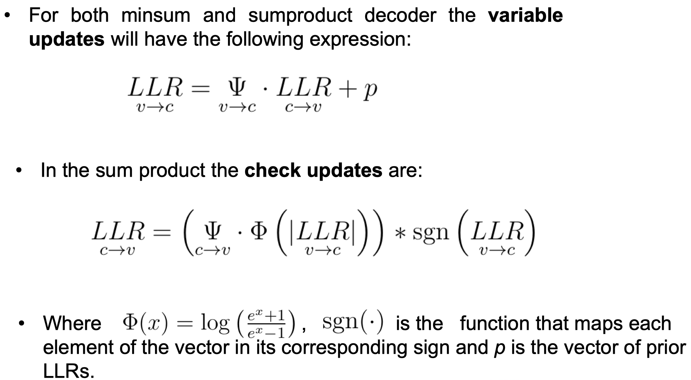
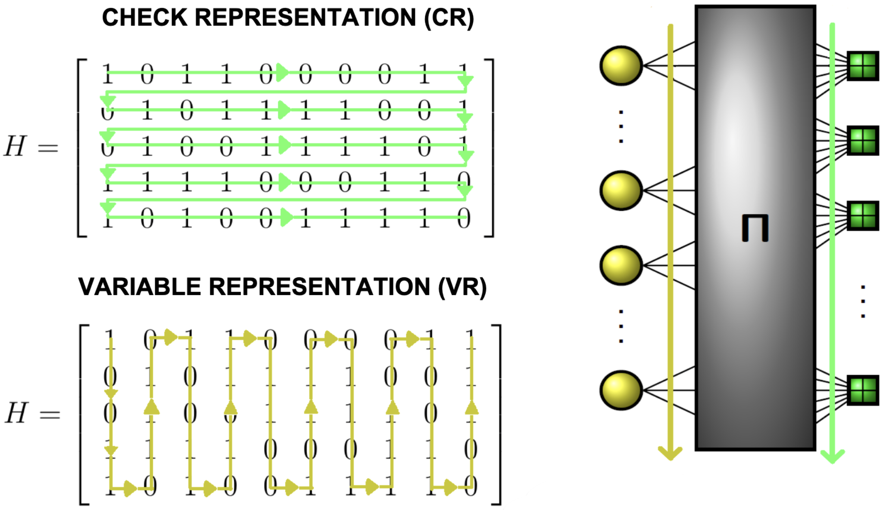
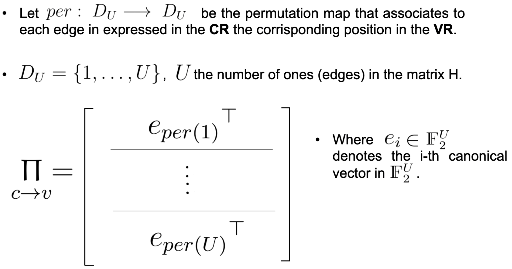
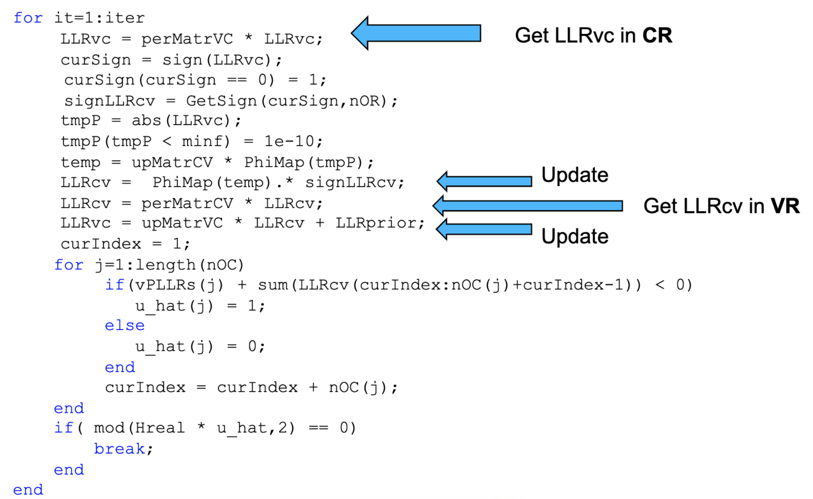

# Channel-Coding-Project
## LDPC codes
Low-Density Parity-Check (LDPC) codes are a block codes: i.e., collection of binary vectors of fixed length. A regular LDPC code has the property that every code digit is contained in the same number of equations and each equation contains the same number of code
symbols. An LDPC can be represented using a bipartite graph, allowing the decoding phase to be execute via the Message-Passing algorithm.

## This work
The purpose of this repo is to implement the LDPC encoding and decoding phase of the G.hn ITU G9960 standard proposed by the ITU-T. 
An efficient version of the min-sum and sum-product algorithms which leveraged the properties of permutation matrices has been developed. The formulation allowed me to work on Matlab instead of completely moving to C, obtaining the same performance while saving time and making the implementation simpler. Please, for more details, please see my [presentation](docs/Presentation_CC.pdf).


Keywords: LDPC codes, Permutation Matrices, Message Passing, MC simulations

# Key ideas in the decoding procedure
### <br><b>(1) - Precompute matrices and vectors from H: </b>
<br>
<br>
<br>
### <br><b>(2) - Updates in min-sum and sum-product:</b>
<br>
### <br><b>(3) - Change from check and variables representation:</b>
<br>
#### <br><b>(3.1) - Permutation matrices:</b>
<br>
#### <br><b>(3.2) - Change of representation as an inverse operation:</b>
<br>
## <br><b>(4) - Putting everything together:</b>
<br>

### Structure of the folders
core: core functions for the message passing algorithm.

mat_files: preprocessed files containinig information on H.

mex_func: MEX files calling C function from MATLAB® (https://it.mathworks.com/help/matlab/matlab_external/standalone-example.html;jsessionid=7ff3c81c955ddf63a79efb00583c)

simulation: simulation files

```
├── README.md
├── code
│   ├── core
│   │   ├── AssignLLRs.m
│   │   ├── CalculateNumOnes.m
│   │   ├── ComputeSign.m
│   │   ├── ComputeTranProb
│   │   ├── CreatePermutationMatrix.m
│   │   ├── CreateUpdateMatrix.m
│   │   ├── EncoderLDPC.m
│   │   ├── FindMin2.m
│   │   ├── GetData.m
│   │   ├── GetMatrix.m
│   │   ├── GetPattern.m
│   │   ├── GetSymbolForAllPer.m
│   │   ├── LLR_BICM.m
│   │   ├── MatrixPreProcessing.m
│   │   ├── MinSumDecoder.m
│   │   ├── MinSumDecoder2.m
│   │   ├── PlotComp.m
│   │   ├── PlotPun.m
│   │   ├── Puncturing.m
│   │   ├── PuncturingLLR.m
│   │   ├── SumProdDecoder.m
│   │   ├── SumProdDecoderPAM.asv
│   │   ├── SystematicForm.m
│   │   ├── graphics_new.asv
│   │   └── graphics_new.m
│   ├── mat_files
│   │   ├── c1_MS_M1.mat
│   │   ├── c1_SP_M1.mat
│   │   ├── c2_MS_M1.mat
│   │   ├── c2_SP_M1.mat
│   │   ├── c3_MS_M1.mat
│   │   ├── c3_SP_M1.mat
│   │   ├── c5_MS_M1.mat
│   │   ├── c5_SP_M1.mat
│   │   ├── c6_MS_M1.mat
│   │   ├── c6_P1_MS_M1.mat
│   │   ├── c6_P2_MS_M1.mat
│   │   ├── c7_P1_SP_M1.mat
│   │   ├── c7_P2_SP_M1.mat
│   │   └── c7_SP_M1.mat
│   ├── mex_func
│   │   ├── ComputeTranProb.c
│   │   ├── ComputeTranProb.mexw64
│   │   ├── ConstMapper2.asv
│   │   ├── ConstMapper2.c
│   │   ├── ConstMapper2.mexw64
│   │   ├── ConstMapper4.c
│   │   ├── ConstMapper4.mexw64
│   │   ├── FindMin2.asv
│   │   ├── FindMin2.c
│   │   ├── FindMin2.mexw64
│   │   ├── GetSign.c
│   │   ├── GetSign.mexw64
│   │   ├── PhiMap.c
│   │   ├── PhiMap.mexw64
│   │   ├── SignOf.c
│   │   ├── SignOf.m
│   │   └── SignOf.mexw64
│   └── simulation
│       ├── Multiple_simulation_BICM.asv
│       ├── Multiple_simulation_BICM.m
│       ├── simulation_BICM.asv
│       ├── simulation_BICM.m
│       └── simulation_diffNit.m
└── docs
    └── Presentation_CC.pdf
```
